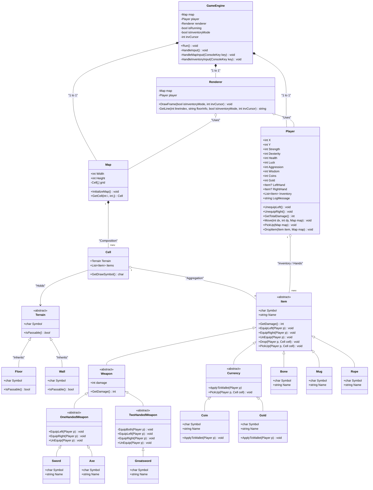
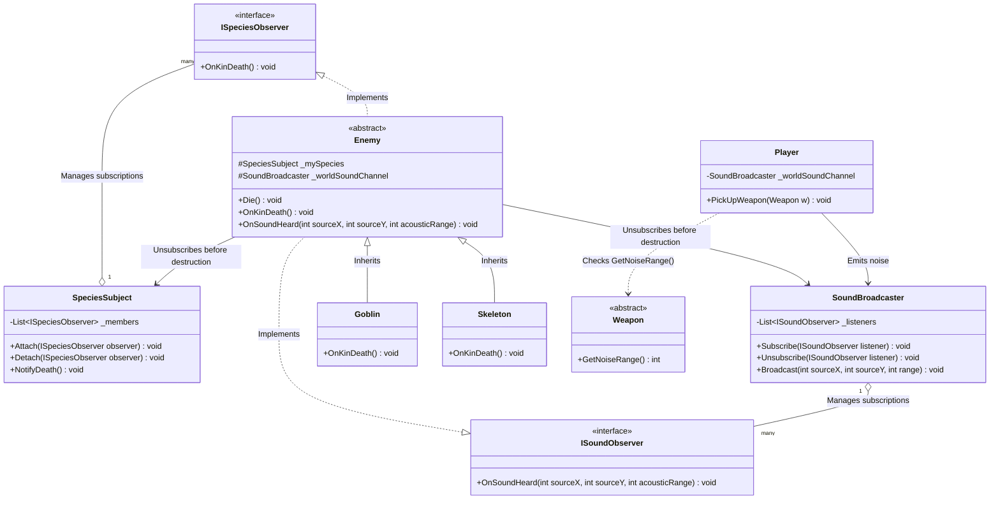
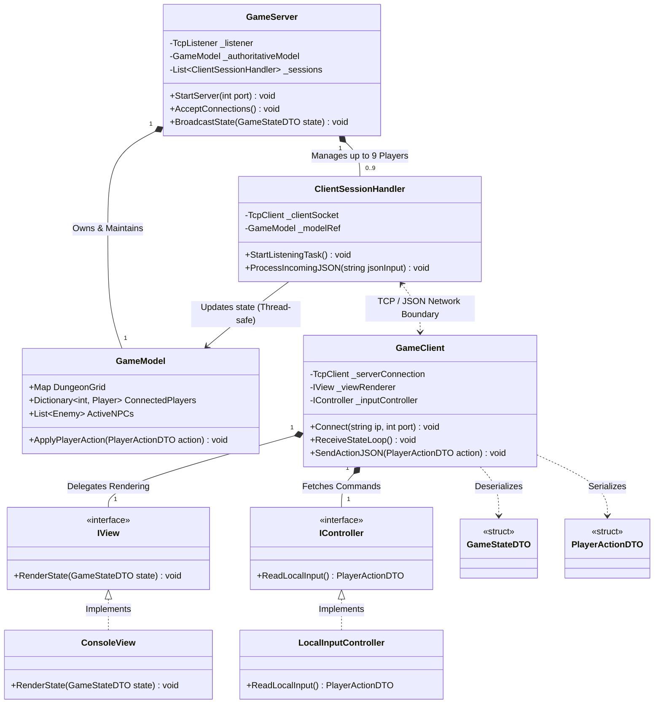

# ⚔️ Console RPG: TCP Multiplayer & MVC Architecture

<p align="center">
  
  
  
  
  
</p>
<p align="center">
  
</p>

## 📖 Overview

This project represents a **scalable, real-time client-server system** for multi-user interaction, implemented in C#. Throughout its 7-stage evolution, the architecture transitioned from a monolithic console-based game engine into a **distributed system** featuring an **authoritative server** and support for up to 9 concurrent network clients. The development focused on strict **MVC-based decomposition**, ensuring complete decoupling of business logic from presentation and networking layers.

The core engineering constraint of this project was absolute adherence to **Object-Oriented Programming (OOP) principles**. The codebase strictly avoids **Run-Time Type Information (RTTI)** such as `is`, `as`, `typeof`, and type-identifying `enums`. Instead, all logic is driven by **clean polymorphism** and classical **Gang of Four (GoF) design patterns**.


## 🏗️ Architectural Highlights

* **Model (Source of Truth):** Encapsulates the entire game state (map grid, player stats, NPC behavior, item locations). Entirely decoupled from the console and network layers.
* **View:** Implements separate renderers for the local console and remote network clients (via JSON payloads).
* **Controller:** Validates player input and routes actions to the Model. Each client session is handled by an isolated controller instance.
* **Concurrency & Networking:** Implemented using `TcpListener` and `TcpClient`. Thread safety is ensured through `lock` mechanisms and concurrent collections, allowing the server to handle multiple simultaneous TCP requests without race conditions.


## 🧩 Applied Design Patterns

| Design Pattern | Implementation in Project | Solved Engineering Problem |
| :--- | :--- | :--- |
| **Observer** | Sound Propagation & Herd AI | Allowed enemies to react to noise and intra-species deaths without tight coupling. Implemented *without* the C# `event` keyword to demonstrate deep OOP understanding. |
| **Composite** | Slotted Items & Sockets | Handled complex inventory math recursively (e.g., calculating stats for a sword holding a socket, which holds another socket and a magic stone). |
| **Decorator** | Dynamic Weapon Modifiers | Applied infinite stackable modifiers (e.g., "Unlucky", "Strong") to weapons during world generation without modifying base classes. |
| **Strategy / Builder** | Procedural Dungeon Generation | Enabled modular creation of dungeons based on specific configuration "Themes" (e.g., corridors, rooms, artifact placements). |
| **State** | Reactive Enemy AI | Allowed NPCs to dynamically switch behaviors (Follow, Flee, Ignore) based on a Sight > Sound priority hierarchy and HP thresholds. |
| **Singleton** | Configuration Manager / Logger | Ensures a single point of access to the external configuration files and global event logging stream across all modules. |
| **Director** | Dungeon Generation Control | Orchestrates the sequence of building steps (empty, corridors, central rooms, loot) defined in the Builder interface to produce consistent dungeon layouts. |
| **Visitor** | Combat & Statistic Calculation | Decouples the operation of calculating combat modifiers (or stat propagation) from the item hierarchy, allowing new operations without modifying Item classes. |


---

## 🚀 Key Features by Development Stage
<details>
<summary><strong>Stages 1–2: Engine & Procedural Generation</strong></summary>
Implemented a grid-based engine with modular dungeon generation using strategy-based building blocks (halls, rooms, artifacts).



</details>

<details>
<summary><strong>Stage 3: Polymorphic Combat System</strong></summary>

*  **Decorator Pattern for Item Modifiers:** Weapons and items can receive infinite, stackable modifiers (e.g., "+5 Damage", "-5 Luck") upon generation. This was achieved by implementing the Decorator pattern, where modifier classes wrap the base item. The base item classes remain completely uncoupled and oblivious to their enhancements, dynamically calculating compounded names (e.g., *"Sword (Unlucky) (Strong)"*) and stats at runtime.
* **Visitor / Double Dispatch Combat Resolution:** Introduced interactive enemies with Armor and HP. Weapons were classified into three polymorphic categories (*Heavy, Light, Magic*), and players were given three distinct attack styles (*Normal, Stealth, Magic*). The architecture leverages a Strategy/Visitor hybrid pattern. Attack styles act as visitors, interacting directly with the specific type of weapon equipped to calculate the final math.

```mermaid
classDiagram
    direction TB

    %% --- DECORATOR PATTERN: MODYFIKATORY PRZEDMIOTÓW ---
    class Item {
        <<abstract>>
        +string Name*
        +GetDamage() int
        +GetStatBonus() int
    }

    class ItemModifier {
        <<abstract>>
        #Item _wrappee
        +string Name
        +GetDamage() int
        +GetStatBonus() int
        +ItemModifier(Item wrappee)
    }

    class DamageModifier {
        -int _damageBonus
        +string Name
        +GetDamage() int
    }

    class StatModifier {
        -int _statBonus
        -string _statType
        +string Name
        +GetStatBonus() int
    }

    Item <|-- ItemModifier : Dziedziczenie (Decorator)
    ItemModifier o-- Item : Kompozycja (Owija bazowy Item)
    ItemModifier <|-- DamageModifier
    ItemModifier <|-- StatModifier

    %% --- KATEGORIE BRONI ---
    class Weapon {
        <<abstract>>
    }

    class HeavyWeapon {
        <<abstract>>
        +Accept(IAttackStrategy strategy, Player p) int
    }

    class LightWeapon {
        <<abstract>>
        +Accept(IAttackStrategy strategy, Player p) int
    }

    class MagicWeapon {
        <<abstract>>
        +Accept(IAttackStrategy strategy, Player p) int
    }

    Item <|-- Weapon
    Weapon <|-- HeavyWeapon
    Weapon <|-- LightWeapon
    Weapon <|-- MagicWeapon

    %% --- SYSTEM WALKI I WROGOWIE ---
    class Enemy {
        +int HealthPoints
        +int AttackValue
        +int ArmorPoints
        +TakeDamage(int damage) void
        +PerformCounterAttack(Player p) void
    }

    class Player {
        +PerformAttack(Enemy target, IAttackStrategy strategy) void
        +TakeDamage(int incomingDamage, IAttackStrategy lastUsedStrategy) void
    }

    %% --- VISITOR / STRATEGY PATTERN: MECHANIKA ATAKU I OBRONY ---
    class IAttackStrategy {
        <<interface>>
        +CalculateDamage(HeavyWeapon w, Player p) int
        +CalculateDamage(LightWeapon w, Player p) int
        +CalculateDamage(MagicWeapon w, Player p) int
        +CalculateDefense(Weapon w, Player p) int
    }

    class NormalAttack {
        +CalculateDamage(HeavyWeapon w, Player p) int
        +CalculateDamage(LightWeapon w, Player p) int
        +CalculateDamage(MagicWeapon w, Player p) int
        +CalculateDefense(Weapon w, Player p) int
    }

    class StealthAttack {
        +CalculateDamage(HeavyWeapon w, Player p) int
        +CalculateDamage(LightWeapon w, Player p) int
        +CalculateDamage(MagicWeapon w, Player p) int
        +CalculateDefense(Weapon w, Player p) int
    }

    class MagicAttack {
        +CalculateDamage(HeavyWeapon w, Player p) int
        +CalculateDamage(LightWeapon w, Player p) int
        +CalculateDamage(MagicWeapon w, Player p) int
        +CalculateDefense(Weapon w, Player p) int
    }

    IAttackStrategy <|.. NormalAttack : Atak zwykły
    IAttackStrategy <|.. StealthAttack : Atak skryty
    IAttackStrategy <|.. MagicAttack : Atak magiczny
    
    Player --> IAttackStrategy : Wybiera rodzaj ataku
    Player --> Enemy : Inicjuje walkę
    
    %% Double Dispatch representation (Visitor)
    IAttackStrategy ..> HeavyWeapon : Oblicza na podst. Siły
    IAttackStrategy ..> LightWeapon : Oblicza na podst. Zręczności
    IAttackStrategy ..> MagicWeapon : Oblicza na podst. Mądrości

```


</details>

<details>
<summary><strong>Stage 4: Configuration & Event Logging</strong></summary>
System initialization via external JSON/INI files. Implemented a thread-safe event log capturing all critical game state changes.

```mermaid
  classDiagram
    direction TB

    %% --- CONFIGURATION SYSTEM (SINGLETON PATTERN) ---
    class ConfigManager {
        -static ConfigManager _instance
        -static readonly object _lock
        -GameConfig _config
        -ConfigManager()
        +static ConfigManager Instance$
        +LoadConfiguration(string filePath) void
        +GetPlayerName() string
        +GetThemeName() string
        +GetLogFilePath() string
    }

    class GameConfig {
        +string PlayerName
        +string DungeonTheme
        +string LogPath
    }
    
    ConfigManager *-- GameConfig : Composition (Holds loaded data)

    %% --- EVENT LOGGER SYSTEM (SINGLETON & STRATEGY PATTERNS) ---
    class ILogger {
        <<interface>>
        +Log(string message) void
        +GetRecentLogs(int count) List~string~
        +GetAllLogs() List~string~
    }

    class GameLogger {
        -static GameLogger _instance
        -static readonly object _lock
        -List~string~ _logsHistory
        -StreamWriter _fileWriter
        -GameLogger()
        +static GameLogger Instance$
        +Initialize(string playerName, string logPath) void
        +Log(string message) void
        +GetRecentLogs(int count) List~string~
        +GetAllLogs() List~string~
        -CreateUniqueLogFile(string name, string path) void
    }
    
    ILogger <|.. GameLogger : Realization (Allows easy logger swapping)

    %% --- DUNGEON THEME SYSTEM (ABSTRACT FACTORY / TEMPLATE PATTERN) ---
    class IDungeonTheme {
        <<interface>>
        +string WelcomeMessage
        +IMapGenerationStrategy GenerationStrategy
        +GetThemeItemPool() List~Item~
        +GetSpecialArtifact() Item
        +GetThemeEnemyNames() List~string~
    }

    class AncientLibraryTheme {
        +string WelcomeMessage : "The smell of old books fills the air..."
        +IMapGenerationStrategy GenerationStrategy
        +GetThemeItemPool() List~Item~
        +GetSpecialArtifact() Item : "Black Wand"
        +GetThemeEnemyNames() List~string~
    }

    class IndustrialForgeTheme {
        +string WelcomeMessage : "The grinding of metal echoes from walls..."
        +IMapGenerationStrategy GenerationStrategy
        +GetThemeItemPool() List~Item~
        +GetSpecialArtifact() Item : "Blaster"
        +GetThemeEnemyNames() List~string~
    }

    class GoldenVaultTheme {
        +string WelcomeMessage : "You feel an itch in your wallet..."
        +IMapGenerationStrategy GenerationStrategy
        +GetThemeItemPool() List~Item~
        +GetSpecialArtifact() Item : "Lucky Bag of Coins"
        +GetThemeEnemyNames() List~string~
    }

    IDungeonTheme <|.. AncientLibraryTheme
    IDungeonTheme <|.. IndustrialForgeTheme
    IDungeonTheme <|.. GoldenVaultTheme

    %% --- DUNGEON GENERATION GENERATOR (STRATEGY PATTERN) ---
    class IMapGenerationStrategy {
        <<interface>>
        +GenerateMapLayout(Map map) void
    }

    class MultipleCorridorsStrategy {
        +GenerateMapLayout(Map map) void
    }

    class NumerousRoomsStrategy {
        +GenerateMapLayout(Map map) void
    }

    class CentralVaultStrategy {
        +GenerateMapLayout(Map map) void
    }

    IMapGenerationStrategy <|.. MultipleCorridorsStrategy
    IMapGenerationStrategy <|.. NumerousRoomsStrategy
    IMapGenerationStrategy <|.. CentralVaultStrategy

    IDungeonTheme --> IMapGenerationStrategy : Strategy Link (Encapsulates layout logic)

    %% --- REFACTORED ENGINE MECHANICS (STAGE 4 INTEGRATION) ---
    class GameEngine {
        -ILogger _logger
        -IDungeonTheme _activeTheme
        +HandleMapInput(ConsoleKey key) void
        %% Pressing 'J' extracts full event log stream via ILogger
    }

    GameEngine ..> ConfigManager : Fetches profile and path specs on boot
    GameEngine o-- IDungeonTheme : Orchestrates environment generation
    GameEngine --> ILogger : Triggers logs universally (Invalid inputs, wall hits, etc.)
```
  

</details>

<details>
<summary><strong>Stages 5 : AI Behavior & Acoustic Pathfinding</strong></summary>
  
This stage introduces reactive environmental systems and decoupled communication using a custom **Observer** pattern (strictly avoiding the C# event).
* Herd AI (Collective Behavior): Enemies are grouped into species subjects. When an entity dies, it broadcasts its death to its kin before unregistering (e.g., Goblins lose stats, aggressive Skeletons gain stats).
* Sound Propagation: Picking up weapons emits noise events based on weight class (Heavy = far, Light = close). The player broadcasts the sound and enemies calculate if the sound reaches them using grid pathfinding taking in considiration walls.
* Memory Safety: Strict decoupling ensures that dying enemies explicitly unsubscribe from all observable lists to prevent memory leaks and zombie references.


</details>

<details>
<summary><strong>Stage 6: TCP Multiplayer & MVC Architecture </strong></summary>
  
Transitions the monolithic engine into a networked multiplayer game (up to 9 concurrent players) using strict MVC decoupling and TCP/JSON communication.
* **MVC Refactoring**: 
  * Model (Source of Truth): Encapsulates all game state/logic. Zero references to console or network.
  * View: Purely renders received JSON data to the console. Zero game logic.
  * Controller: Validates local inputs and routes actions to the Model.
* **Authoritative Server**: Uses TcpListener with multi-threading (one Task/Thread per client). Safely processes concurrent JSON inputs using lock and broadcasts state updates to all clients.
* **Remote Clients**: Use TcpClient to send local keystrokes as JSON to the server and strictly render the authoritative state received.


</details>
<details>
<summary><strong>Stage 7: in progress ... </strong></summary>
</details>

## 🔧 Technical Setup

**System Requirements:**
* .NET SDK 8.0+

**Running the System:**

1. **Start the Server:**
   ```bash
   dotnet run -- --server 5555
   ```
2. **Connect a Client:**
   ```bash
   dotnet run -- --client 127.0.0.1:5555
   ```
---
Developed as a project for Object-Oriented Programming (Warsaw University of Technology).
